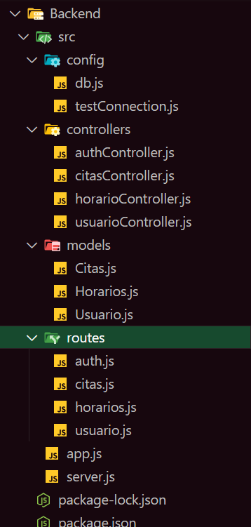
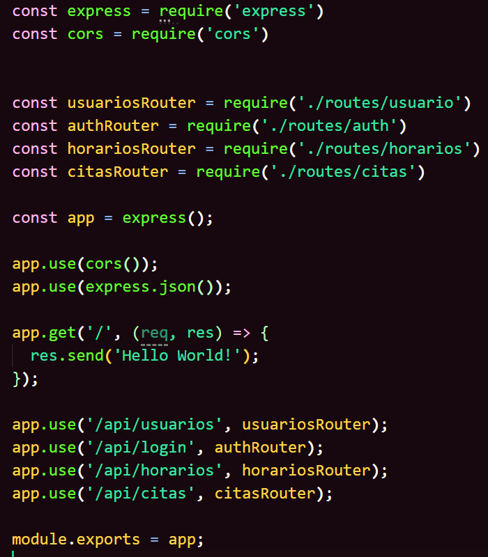
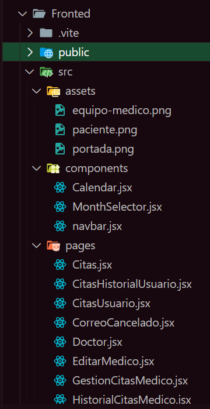
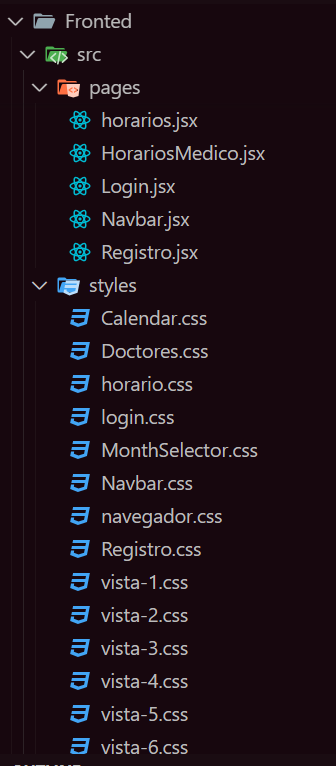
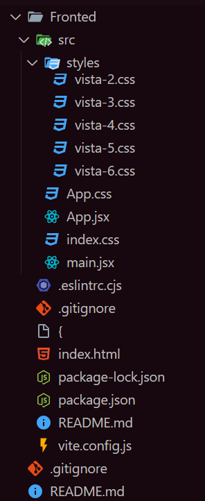
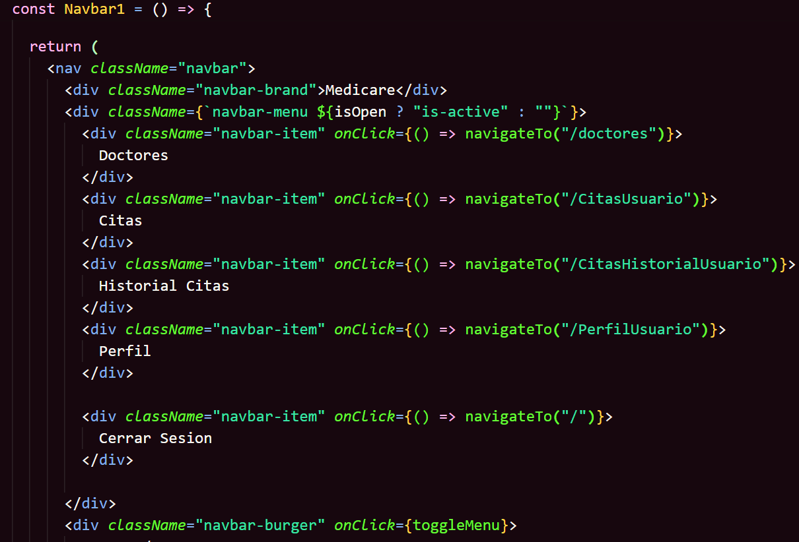
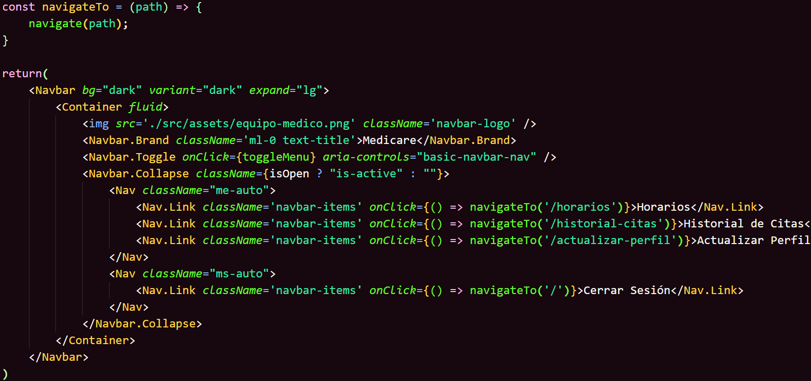
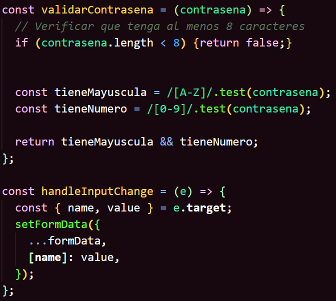
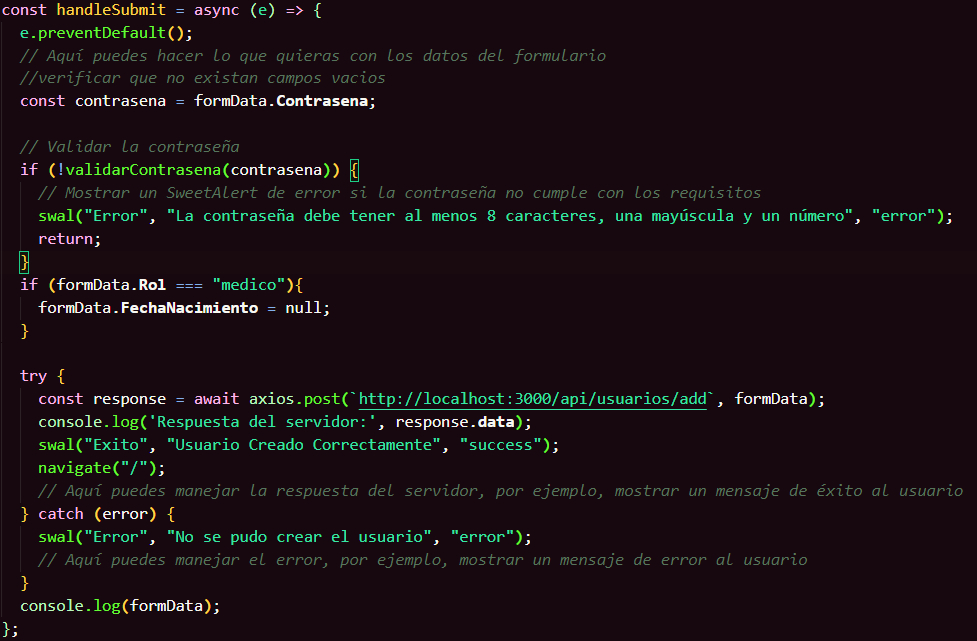

<center>

|           Nombre                      |  Carnet   |
|             --                        |    --     |
| Andre Joaquin Ortega De Paz           | 201900597 |
| Jonatan Leonel Garcia Arana           | 202000424 |
| Christopher Iván Monterroso Alegria   | 201902363 |
| Erick Abdul Chacón Barillas           | 201807169 |
| Albertt Wosveli Itzep Raymundo        | 201908658 |


# UNIVERSIDAD DE SAN CARLOS DE GUATEMALA
## Facultad de Ingeniería 
## Escuela de Ciencias y Sistemas 

<div style="text-align:center">
    
    
</div>

# PROYECTO 2 - FASE 1
## Analisis y Diseño 1
#### 18 de Junio del 2024
___
</center>

## Rutas utilizadas en el Backend

En estas dos imagenes tenemos lo siguiente:

- Se realizo una estructura de como organizamos el backend tales como configuraciones para la base de datos del proyecto, controladores para realizar consultas, modelos para realizar inserciones, actualizaciones, etc. rutas para las peticiones ya que estamos manejando una API para realizar el proyecto.

- En la siguiente captura es un esquema que se manejo la api en este caso las rutas y estas se consultan por lado de los controladores que se muestra en la estructura de la carpeta "Backend".

Carpeta Backend
<center>



</center>


### Rutas utilizadas en el Frontend
___

En ese apartado tenemos lo siguiente:

- Contamos con una carpeta assets para el almacenamiento de imagenes ya sean para colocarlos como logotipos, iconos de usuario, fondos de pantalla llamativos, etc.

- Una carpeta components en donde realizamos la programación para darle funcionamiento a los componentes tales como formularios, barras de navegacion, botones, etc.

- Una carpeta pages para tener las vistas de una manera muy organizada utilizando herramientas como useNavigate, para poder navegar entre vistas utilizando eventos.

- Una carpeta styles para manejar estilos y decoraciones a las vistas esto con el fin de tener una interfaz responsiva y atractiva para el usuario que se dirija a nuestro sitio.

Carpeta Frontend
<center>


</center>

<center>


</center>

<center>


</center>

-----

En esta seccion contamos con 2 navegadores, dado a que manejamos 2 roles tales como doctores y pacientes, el enfoque que le damos a las vistas es de un navegador en general, pero para fines del proyecto y de poder determinar los roles se realizaron 2

---

---
Navegador 1
<center>


</center>
---

---
Navegador 2
<center>


</center>
---

---
Codigo donde se realizan las diversas validaciones al momento de registrar un usuario nuevo.
<center>


</center>

<center>


</center>

### Base de datos
___
Script de la base de datos utilizado.
```
CREATE DATABASE PROYECTOAYD2;
USE PROYECTOAYD2;
CREATE TABLE Usuarios (
    ID INT AUTO_INCREMENT PRIMARY KEY,
    Nombre VARCHAR(50) NOT NULL,
    Apellido VARCHAR(50) NOT NULL,
    Genero ENUM('M', 'F') NOT NULL,
    Correo VARCHAR(100) UNIQUE NOT NULL,
    Contrasena VARCHAR(255) NOT NULL,
    Rol ENUM('Paciente', 'Medico') NOT NULL,
    Foto VARCHAR(255), -- Ruta de la foto
    FechaNacimiento DATE,
    Especialidad VARCHAR(100),
    DireccionClinica VARCHAR(255)
);

-- Tabla Citas
CREATE TABLE Citas (
    ID INT AUTO_INCREMENT PRIMARY KEY,
    PacienteID INT NOT NULL,
    MedicoID INT NOT NULL,
    Fecha DATE NOT NULL,
    Hora TIME NOT NULL,
    Motivo VARCHAR(255) NOT NULL,
    Estado ENUM('Programada', 'Atendida', 'Cancelada por Paciente', 'Cancelada por Medico') NOT NULL,
    FOREIGN KEY (PacienteID) REFERENCES Usuarios(ID),
    FOREIGN KEY (MedicoID) REFERENCES Usuarios(ID)
);

-- Tabla HorariosMedicos
CREATE TABLE HorariosMedicos (
    MedicoID INT NOT NULL,
    DiaSemana ENUM('Lunes', 'Martes', 'Miércoles', 'Jueves', 'Viernes', 'Sábado', 'Domingo') NOT NULL,
    HoraInicio TIME NOT NULL,
    HoraFin TIME NOT NULL,
    PRIMARY KEY (MedicoID, DiaSemana, HoraInicio, HoraFin),
    FOREIGN KEY (MedicoID) REFERENCES Usuarios(ID)
);

```

---

---


---

# Diagramas

En este apartado se mostraran los diagramas que nos estipula el proyecto ya que el objetivo de este es dar un planteamiento del problema y también realizar los requerimientos que se necesitan para poder comenzar con estructuras, rutas, peticiones, operaciones relacionales, etc. He aquí alguna de ellas.

## Diagrama Entidad-Relacion
___

<center>


</center>

## Diagrama Clases
___
<center>

{width=600}
</center>

## Diagrama Componentes
___
<center>

{width=600}
</center>

## Diagrama Despliegue
___
<center>

{width=600}
</center>

## Mockups

En este apartado se discutio con el equipo para determinar como seran las vistas del proyecto a lo largo del desarrollo, y cabe aclarar de que estos son diseños `tentativos` ya que estas pueden estar sujetos a cambios durante su desarrollo.

<center>

### Login

</center>
<center>

### Registro

</center>
<center>


</center>
<center>


</center>
<center>


</center>


<center>


</center>
<center>


</center>
<center>


</center>
<center>


</center>
<center>


</center>
<center>


</center>
<center>

### Correo

</center>