<center>

|           Nombre                      |  Carnet   |
|             --                        |    --     |
| Andre Joaquin Ortega De Paz           | 201900597 |
| Jonatan Leonel Garcia Arana           | 202000424 |
| Christopher Iván Monterroso Alegria   | 201902363 |
| Erick Abdul Chacón Barillas           | 201807169 |
| Albertt Wosveli Itzep Raymundo        | 201908658 |


# UNIVERSIDAD DE SAN CARLOS DE GUATEMALA
## Facultad de Ingeniería 
## Escuela de Ciencias y Sistemas 

<div style="text-align:center">
    
    
</div>

# PROYECTO 2 - FASE 1
## Analisis y Diseño 1
#### 18 de Junio del 2024
___
</center>

## Rutas utilizadas en el Backend

Carpeta Backend
<center>

{width=600}
{width=600}
</center>


Este es un ejemplo breve de como aplicamos nuestras rutas para poder trabajar por separado cada una de ellas.

<center>

{width=600}
</center>


### Rutas utilizadas en el Frontend
___

Carpeta Frontend
<center>

{width=600}
</center>

Codigo donde se desarrollo las 2 barras de navegacion, el 1ero corresponde a usuario y el 2do al administrador.

<center>

{width=600}
{width=600}
</center>

Codigo donde se realizan las diversas validaciones al momento de registrar un usuario nuevo.
<center>

{width=600}
</center>

### Base de datos
___
Script de la base de datos utilizado.
```
CREATE DATABASE PROYECTOAYD2;
USE PROYECTOAYD2;
CREATE TABLE Usuarios (
    ID INT AUTO_INCREMENT PRIMARY KEY,
    Nombre VARCHAR(50) NOT NULL,
    Apellido VARCHAR(50) NOT NULL,
    Genero ENUM('M', 'F') NOT NULL,
    Correo VARCHAR(100) UNIQUE NOT NULL,
    Contrasena VARCHAR(255) NOT NULL,
    Rol ENUM('Paciente', 'Medico') NOT NULL,
    Foto VARCHAR(255), -- Ruta de la foto
    FechaNacimiento DATE,
    Especialidad VARCHAR(100),
    DireccionClinica VARCHAR(255)
);

-- Tabla Citas
CREATE TABLE Citas (
    ID INT AUTO_INCREMENT PRIMARY KEY,
    PacienteID INT NOT NULL,
    MedicoID INT NOT NULL,
    Fecha DATE NOT NULL,
    Hora TIME NOT NULL,
    Motivo VARCHAR(255) NOT NULL,
    Estado ENUM('Programada', 'Atendida', 'Cancelada por Paciente', 'Cancelada por Medico') NOT NULL,
    FOREIGN KEY (PacienteID) REFERENCES Usuarios(ID),
    FOREIGN KEY (MedicoID) REFERENCES Usuarios(ID)
);

-- Tabla HorariosMedicos
CREATE TABLE HorariosMedicos (
    MedicoID INT NOT NULL,
    DiaSemana ENUM('Lunes', 'Martes', 'Miércoles', 'Jueves', 'Viernes', 'Sábado', 'Domingo') NOT NULL,
    HoraInicio TIME NOT NULL,
    HoraFin TIME NOT NULL,
    PRIMARY KEY (MedicoID, DiaSemana, HoraInicio, HoraFin),
    FOREIGN KEY (MedicoID) REFERENCES Usuarios(ID)
);

```
Peliculas ingresadas.
<center>

{width=600}
</center>

## Diagrama Entidad-Relacion
___

<center>

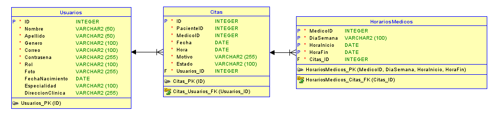
</center>

## Diagrama Clases
___
<center>

{width=600}
</center>

## Diagrama Componentes
___
<center>

{width=600}
</center>

## Diagrama Despliegue
___
<center>

{width=600}
</center>

## Mockups

<center>

### Login
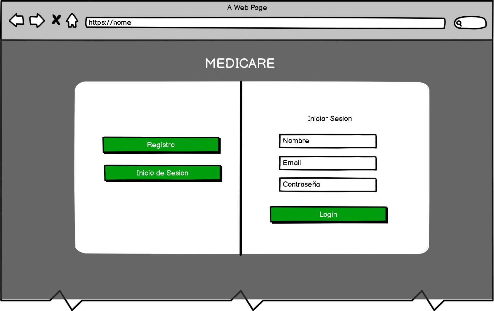{width=600}
</center>
<center>

### Registro
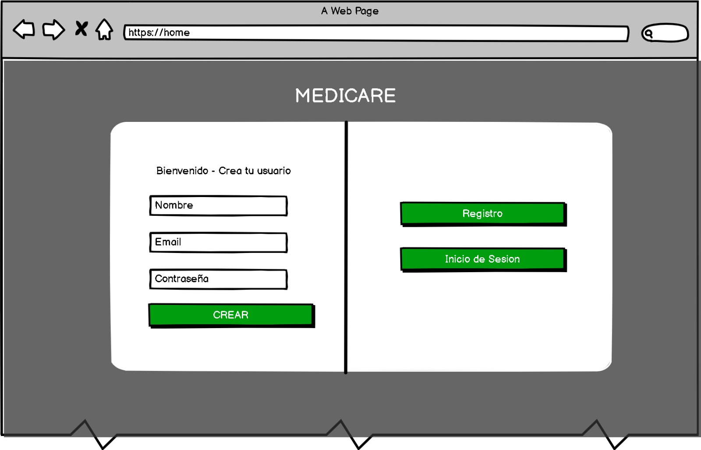{width=600}
</center>
<center>

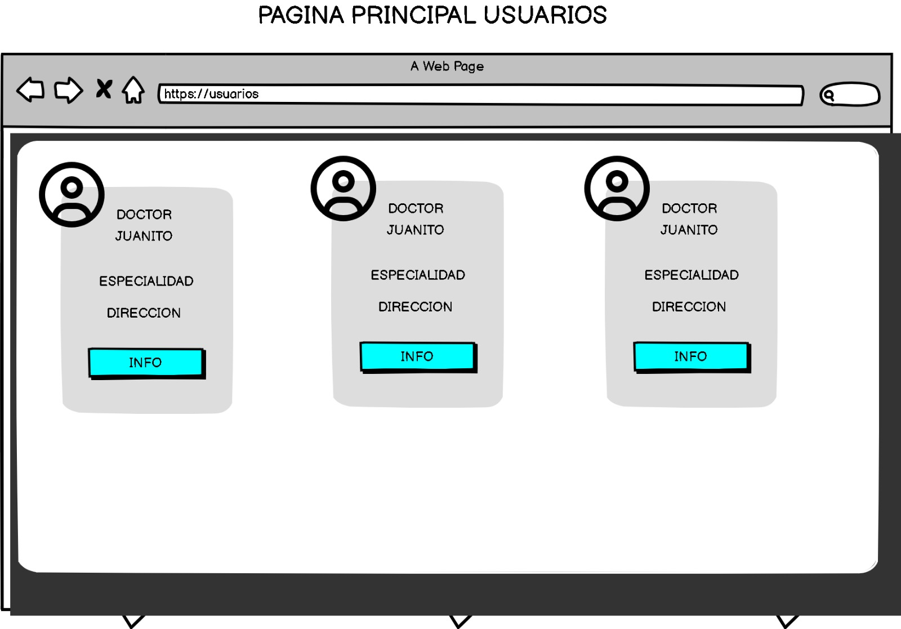{width=600}
</center>
<center>

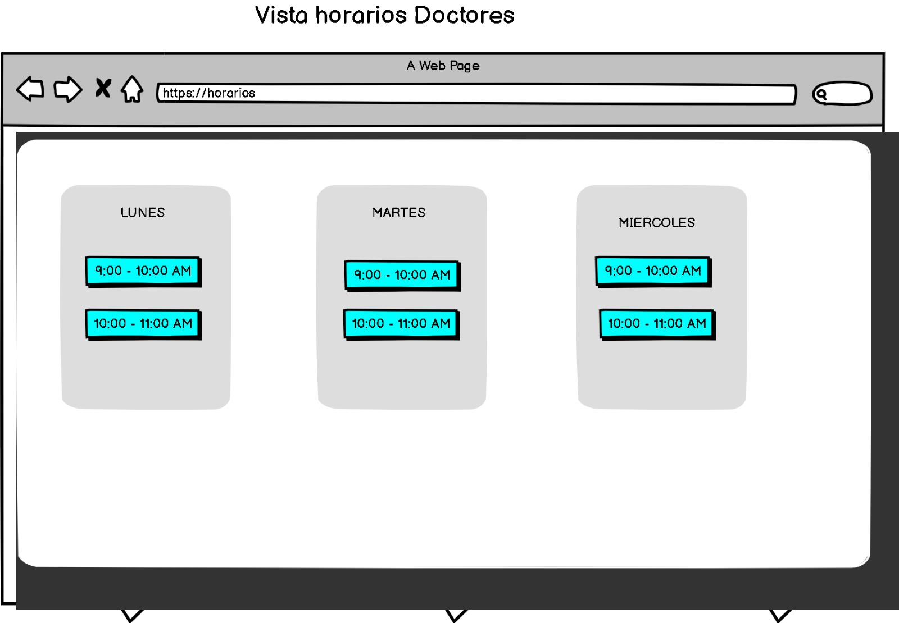{width=600}
</center>
<center>

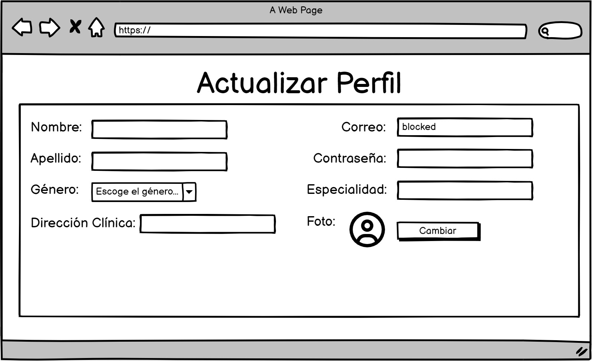{width=600}
</center>


<center>

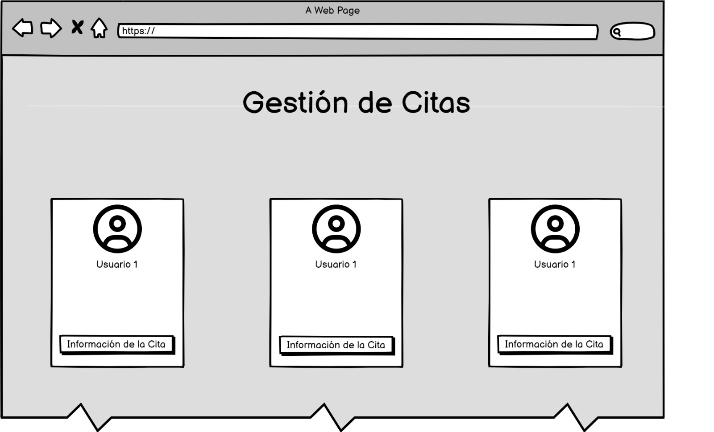{width=600}
</center>
<center>

{width=600}
</center>
<center>

{width=600}
</center>
<center>

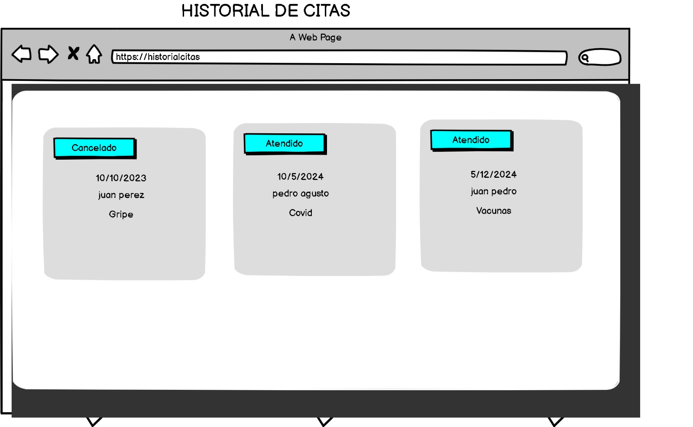{width=600}
</center>
<center>

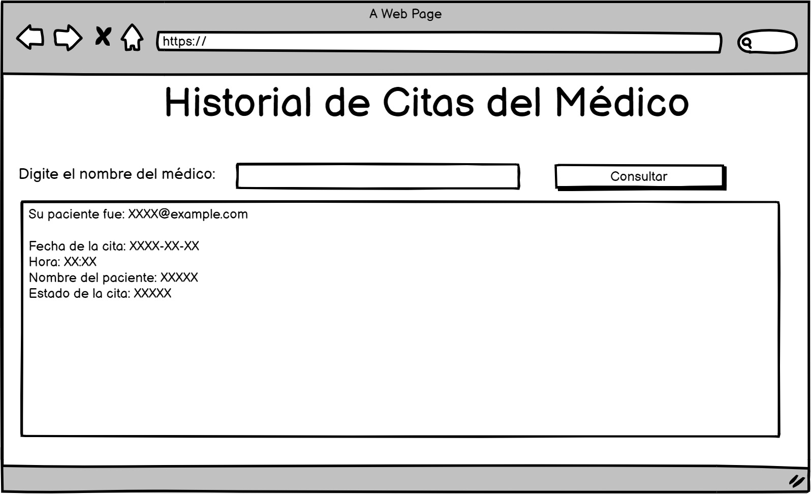{width=600}
</center>
<center>

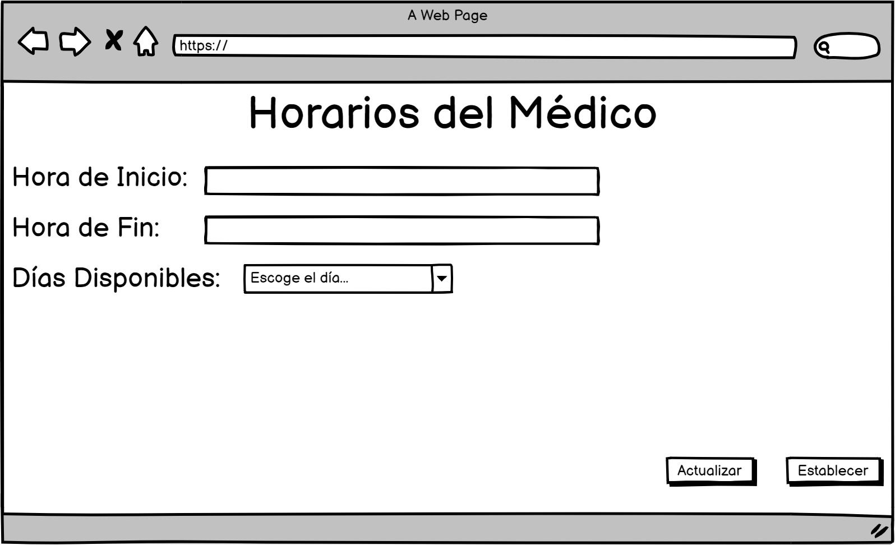{width=600}
</center>
<center>

### Correo
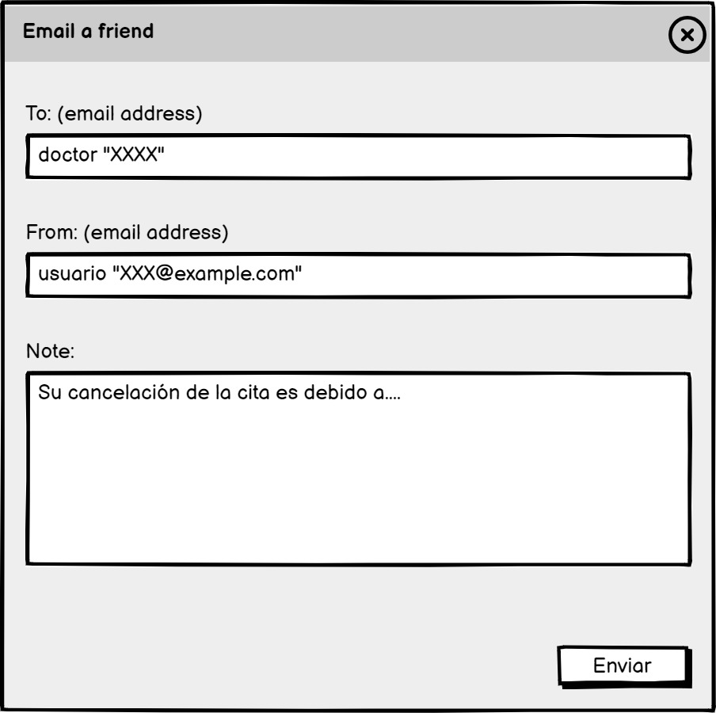{width=600}
</center>